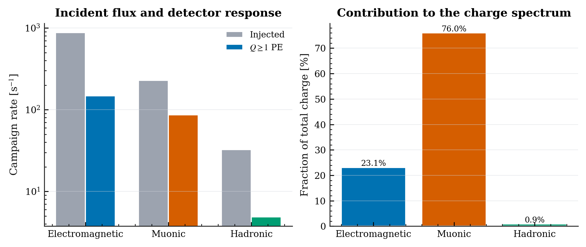
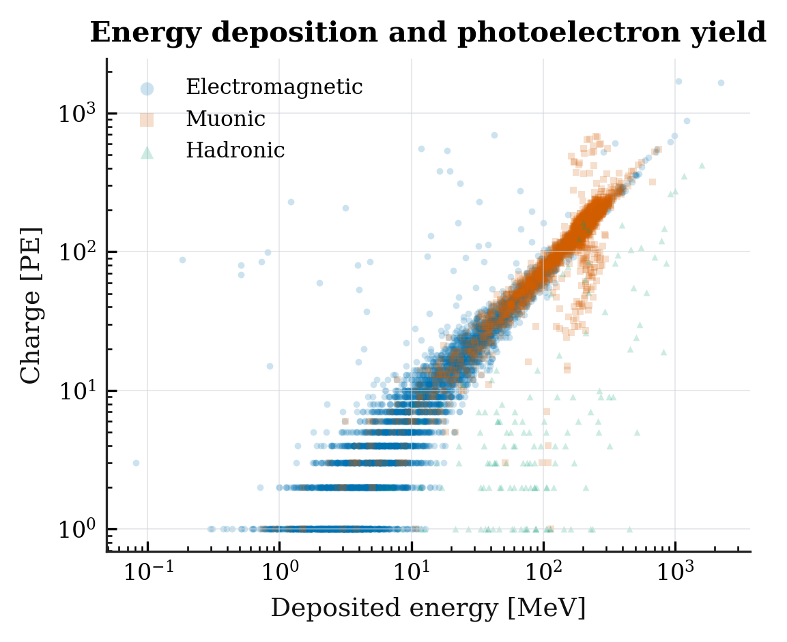
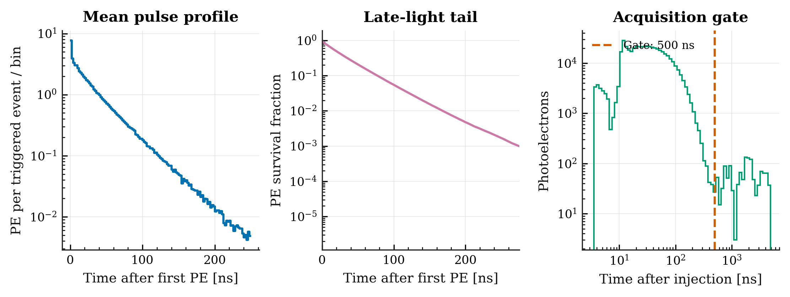

# Introducción a la simulación de detectores con MEIGA

Esta guía supone que el estudiante nunca ha utilizado Docker. Al terminar podrá
simular un detector Cherenkov de agua (WCD) y generar automáticamente el
análisis físico, las tablas y las gráficas. No necesita instalar Geant4 ni
MEIGA directamente en su computador.

> **Si utiliza Windows:** escriba todos los comandos de esta guía en la terminal
> de Ubuntu o Debian de WSL, no en PowerShell ni en el símbolo del sistema.
> Docker Desktop debe estar abierto mientras trabaja.

## Recorrido recomendado en cinco comandos

Después de instalar los requisitos, esta es la secuencia completa:

```bash
git clone https://github.com/rmartinezra/introduccion-simulacion-detectores-meiga.git
cd introduccion-simulacion-detectores-meiga
./meiga-school install --pull
./meiga-school doctor
./meiga-school run wcd-30s --smoke 60
```

No agregue `docker` ni `sudo` delante de `./meiga-school`. Las siguientes
secciones explican qué hace cada comando y qué debe observar.

## Cuatro conceptos antes de comenzar

En este curso, la palabra *imagen* puede tener dos significados diferentes:
una **imagen Docker** es el paquete de software del laboratorio; una imagen
PNG es una **gráfica** producida por el análisis.

| Concepto | Significado en este curso |
|---|---|
| Repositorio | Esta carpeta: contiene la guía, configuraciones, flujos y scripts. |
| Imagen Docker | Paquete inmutable con Ubuntu, Geant4, MEIGA y los ejecutables. Se descarga una sola vez. |
| Contenedor | Instancia de trabajo creada a partir de la imagen Docker. Se llama `meiga_school`. |
| Resultados | Archivos guardados en `results/runs/` dentro del repositorio y visibles desde el sistema anfitrión. |

El flujo es:

```text
repositorio y configuración
          ↓
    ./meiga-school
          ↓
contenedor con MEIGA  →  simulación
          ↓
results/runs/<run-id>/ en el computador del estudiante
```

Cerrar la terminal no elimina la imagen, el contenedor ni los resultados.

## Primera simulación WCD paso a paso

### 1. Prepare el computador

- Linux de 64 bits o Windows con WSL2.
- Docker Engine en Linux o Docker Desktop con integración WSL2.
- Git, Bash y Python 3.10 o posterior.
- 8 GiB de RAM y 15 GiB libres como mínimo.

La guía [Instalación en WSL y Linux](docs/installation.md) contiene comandos
para Ubuntu, Debian, Fedora, Arch Linux y openSUSE.

Antes de clonar el curso, abra la terminal Linux o WSL y ejecute:

```bash
docker info
git --version
python3 --version
```

- `docker info` debe mostrar información del servidor sin terminar en error.
- Git debe mostrar un número de versión.
- Python debe ser 3.10 o posterior.

Si `docker info` falla, no continúe todavía. En WSL, abra Docker Desktop y
active **Settings → Resources → WSL Integration** para su distribución. En
Linux, inicie Docker y configure a su usuario para utilizarlo.

### 2. Descargue el repositorio

Ubíquese en la carpeta donde quiera conservar el curso y ejecute:

```bash
git clone https://github.com/rmartinezra/introduccion-simulacion-detectores-meiga.git
cd introduccion-simulacion-detectores-meiga
```

`git clone` descarga los archivos del curso. `cd` entra en esa carpeta. Los
comandos siguientes deben ejecutarse desde allí.

El repositorio es público: no necesita una cuenta de GitHub.

### 3. Instale con la imagen precompilada

Esta es la opción recomendada para todos los estudiantes:

```bash
./meiga-school install --pull
```

El comando:

1. crea el entorno Python local `.venv`;
2. instala NumPy y Matplotlib para los análisis;
3. descarga desde Docker Hub la imagen pública
   `rmartinezmaple/meiga-school:3.2-g4gro`;
4. crea e inicia el contenedor `meiga_school`;
5. comprueba que el ejecutable WCD está disponible.

No necesita una cuenta de Docker Hub. La imagen instalada ocupa
aproximadamente 2.37 GB y solo se descarga completa la primera vez. Espere hasta
ver:

```text
[OK] Instalación lista.
Primera prueba: ./meiga-school run wcd-30s --smoke 60
```

No es necesario activar `.venv`, entrar al contenedor ni aprender comandos
Docker para realizar las prácticas.

### 4. Compruebe la instalación

```bash
./meiga-school doctor
```

El diagnóstico revisa la distribución, Python, Docker, la imagen, el
contenedor y los recursos disponibles. Corrija cualquier línea marcada como
error antes de continuar.

### 5. Ejecute la primera simulación

La prueba recomendada usa 60 partículas:

```bash
./meiga-school run wcd-30s --smoke 60
```

`--smoke 60` significa “prueba corta con 60 partículas”. Sirve para comprobar
todo el flujo sin esperar una campaña completa.

Este único comando:

1. prepara una muestra reproducible del flujo;
2. ejecuta `G4WCDSimulator`;
3. guarda exactamente una visualización `visualization.wrl`;
4. analiza carga, energía, tiempos, eficiencia y componentes;
5. genera 23 figuras PNG de 300 dpi y 23 PDF vectoriales.

Cada ejecución crea un identificador nuevo y nunca sobrescribe resultados.
Al terminar, muestra la ruta exacta, normalmente:

```text
results/runs/<run-id>/
├── run/          configuraciones, salida MEIGA y visualization.wrl
├── analysis/     tablas, métricas e informe reproducible
└── plots/        figuras PNG y PDF
```

El programa imprime el valor real de `<run-id>` al terminar. No escriba
literalmente los símbolos `<` y `>`. Para listar primero la ejecución más
reciente:

```bash
ls -dt results/runs/* | head -1
```

Desde WSL puede abrir la carpeta del proyecto en el Explorador de Windows:

```bash
explorer.exe .
```

Los resultados están en el computador del estudiante, no quedan encerrados
dentro del contenedor.

### Ejemplos de resultados

El análisis reproducible de una corrida WCD de 30 segundos genera, entre otras,
las siguientes figuras. Los rótulos se mantienen en inglés para facilitar su
uso directo en informes y artículos.

**Composición del flujo y contribución al espectro de carga**



**Correlación entre energía depositada y carga detectada**



**Perfil temporal, cola de luz tardía y ventana de adquisición**



Estas son tres de las 23 figuras PNG y PDF que produce automáticamente
`./meiga-school run wcd-30s`. Cada estudiante obtiene su propia copia dentro de
`results/runs/<run-id>/plots/`.

## ¿Descargar o compilar la imagen Docker?

Existen las dos opciones. Si no sabe cuál escoger, use **descargar**.

| Opción | Para quién | Qué ocurre |
|---|---|---|
| Descargar con `--pull` | Estudiantes y docentes que realizarán las prácticas | Descarga la imagen oficial ya compilada. Es la ruta rápida y reproducible. |
| Compilar con `--build` | Desarrolladores que modificarán C++ o la construcción | Construye Geant4, MEIGA, Hodoscopio, Torre, WCD y G4GRO dentro de Docker. |

### Opción A: descargar desde Docker Hub

```bash
./meiga-school install --pull
```

Esta opción no compila Geant4 en el computador del estudiante. Descarga la
versión exacta `3.2-g4gro`, de modo que todo el grupo utiliza el mismo entorno.

También existe un modo automático:

```bash
./meiga-school install
```

Reutiliza la imagen si ya está instalada; si no está, intenta descargarla. Solo
si la descarga falla intenta construirla localmente. Para una clase se
recomienda `--pull`, porque un fallo de red se informa inmediatamente y no
inicia una compilación larga por sorpresa.

### Opción B: construir desde los archivos del repositorio

Esta sección es opcional. No es necesaria para cambiar JSON, XML, flujos ni
scripts de análisis.

Para crear una imagen y un contenedor locales separados de la versión oficial:

```bash
./meiga-school install \
  --build \
  --image meiga-school:local \
  --container meiga_school_local \
  --jobs 2
```

`--jobs 2` permite compilar con dos núcleos. Use `--jobs 1` si el computador
tiene poca memoria, o un valor mayor si dispone de suficientes núcleos y RAM.

Para ejecutar una simulación con ese contenedor local:

```bash
MEIGA_CONTAINER=meiga_school_local \
  ./meiga-school run wcd-30s --smoke 60
```

Si ya existe `meiga-school:local` y necesita reconstruirla después de cambiar
fuentes C++ o el Dockerfile, use `--force-build`. El instalador conserva el
contenedor anterior para evitar pérdida accidental; por eso la reconstrucción
debe recibir un nombre de contenedor nuevo:

```bash
./meiga-school install \
  --force-build \
  --image meiga-school:local \
  --container meiga_school_local_v2 \
  --jobs 2
```

Después seleccione el contenedor nuevo:

```bash
MEIGA_CONTAINER=meiga_school_local_v2 \
  ./meiga-school run wcd-30s --smoke 60
```

| Cambio realizado | ¿Reconstruir la imagen Docker? |
|---|---|
| Parámetros en JSON o XML | No |
| Archivo de flujo `.shw` | No |
| Código del análisis Python | No |
| Fuentes C++ `.cc`/`.hh` de MEIGA o una aplicación | Sí |
| `container/Dockerfile` o scripts de construcción | Sí |

### Comandos Docker equivalentes — referencia avanzada

El instalador recomendado ejecuta internamente operaciones equivalentes a:

```bash
docker pull rmartinezmaple/meiga-school:3.2-g4gro
docker create \
  --name meiga_school \
  rmartinezmaple/meiga-school:3.2-g4gro
docker start meiga_school
```

No es necesario ejecutar estos comandos manualmente. Hacer solamente
`docker pull` descarga la imagen, pero no prepara `.venv`, no crea el
contenedor y no configura el análisis. Por eso debe preferirse
`./meiga-school install --pull`.

La imagen también está publicada como
[`rmartinezmaple/meiga-school:latest`](https://hub.docker.com/r/rmartinezmaple/meiga-school),
pero el curso fija `3.2-g4gro` para evitar cambios inesperados.

## Problemas frecuentes en la primera instalación

- **`docker: command not found`:** está en la terminal incorrecta o Docker aún
  no está instalado/integrado con WSL.
- **`Cannot connect to the Docker daemon`:** abra Docker Desktop en Windows; en
  Linux, inicie el servicio Docker.
- **`permission denied` al ejecutar `./meiga-school`:** ejecute
  `chmod +x meiga-school scripts/*.sh` y vuelva a intentar.
- **El contenedor pertenece a otra imagen:** use el nombre sugerido por el
  instalador, por ejemplo `./meiga-school install --container meiga_school_3_2`.
- **No se puede crear `.venv`:** instale `python3-venv` en Ubuntu o Debian.
- **No hay espacio suficiente:** la descarga necesita varios GB y la
  compilación local requiere al menos 15 GiB libres.

La guía [Instalación en WSL y Linux](docs/installation.md) contiene diagnóstico
por distribución. Si solicita ayuda, copie desde la terminal el comando
ejecutado y el mensaje de error completo.

## Comandos frecuentes

```bash
# Ayuda
./meiga-school help

# Prueba corta y rápida
./meiga-school run wcd-30s --smoke 60

# Prueba separando las componentes EM, muónica y hadrónica
./meiga-school run wcd-30s --smoke 300 --components

# Flujo completo de 30 segundos
./meiga-school run wcd-30s --components

# Proyecto largo con flujo de 5 minutos
./meiga-school run wcd-5min --components
```

Para repetir exactamente una configuración, declare semilla e identificador:

```bash
./meiga-school run wcd-30s \
  --smoke 60 \
  --seed 2026072230 \
  --run-id mi-validacion
```

## Compatibilidad

Los scripts se ejecutan en Bash y no dependen de `apt`, `systemd` ni rutas de
WSL. El mismo flujo funciona con Docker en:

- WSL2 con Ubuntu o Debian;
- Ubuntu y Debian nativos;
- Fedora, RHEL y distribuciones derivadas;
- Arch Linux y openSUSE;
- otras distribuciones Linux con Bash, Docker y Python 3.10+.

El contenedor está construido desde Ubuntu 22.04, por lo que la versión de las
bibliotecas científicas de la distribución anfitriona no cambia la física de
la simulación. Consulte [installation.md](docs/installation.md) para
diagnóstico y alternativas de instalación.

## Campañas WCD

- [Flujo de 30 segundos](experiments/wcd/flux-30s/README.md): campaña principal
  para prácticas y análisis por componentes.
- [Flujo de 5 minutos](experiments/wcd/bariloche-5min/README.md): proyecto largo
  con 196 768 partículas.

El analizador [analyze_wcd.py](analysis/wcd/analyze_wcd.py) es único para ambas
campañas. Usa etiquetas en inglés y produce vistas combinadas y por panel para
las componentes electromagnética, muónica y hadrónica.

## Alcance del curso

El curso se concentra en:

- `G4HodoscopeSimulator`: telescopio de muones con hodoscopios;
- `G4TowSimulator`: torre con planos de detección;
- `G4WCDSimulator`: detector Cherenkov de agua.

ARTI no se modifica. El material histórico permanece en el
[taller anterior](https://github.com/rmartinezra/workshopARTI_MEIGA).

Los módulos llevan al estudiante desde la primera corrida hasta un proyecto
completo:

| Módulo | Tema | Producto |
|---|---|---|
| 00 | Preparación | Entorno diagnosticado |
| 01 | Fundamentos MEIGA/Geant4 | Primera simulación |
| 02 | Configuración y geometría | JSON/XML validados |
| 03 | Hodoscopio | Aceptación y coincidencias |
| 04 | Torre | Comparación de geometrías |
| 05 | WCD | Respuesta en energía y carga |
| 06 | Análisis | Informe reproducible |
| 07 | Proyecto final | Experimento defendible |

## Aplicación externa G4GRO

La imagen incluye G4GRO como aplicación opcional de un colaborador. Su paquete
original permanece intacto y se compila contra una copia privada de MEIGA para
que sus materiales y lista física no afecten Hodoscopio, Torre ni WCD. Consulte
la [guía de G4GRO](external-apps/g4gro/README.md) para ejecutarla, editar `.cc`
y recompilar.

## Organización

```text
analysis/       análisis unificado del WCD
container/      construcción autónoma de Geant4 y MEIGA
docs/           instalación, conceptos y requisitos
experiments/    campañas autocontenidas con JSON, XML y flujos
external-apps/  aplicaciones externas aisladas
modules/        material pedagógico
results/        salidas locales, excluidas de Git
scripts/        instalación, diagnóstico y ejecución
tests/          pruebas automáticas
```

## Principios del proyecto

- Ningún instalador elimina imágenes, contenedores o resultados existentes.
- Todos los valores predeterminados relevantes son explícitos.
- Cada corrida declara entrada, semilla y ubicación de salida.
- Los análisis separan unidades físicas, selección de datos y visualización.
- La imagen se construye desde archivos versionados, no desde un contenedor
  modificado manualmente.

Consulte [ROADMAP.md](ROADMAP.md) para el desarrollo del curso.
